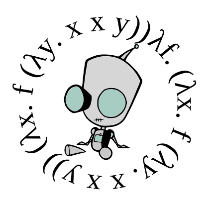

The Irken Compiler
------------------

Irken is a statically-typed, simplified variant of Scheme.  Or... a
lisp-like variant of ML, depending on your point of view.  If you're
not familiar with either family of languages, Irken is a strongly
typed, compiled language with a lisp-like syntax extensible with
macros.  It uses type inference along with a powerful type system to
give you the speed of a compiled language with high-level data types
and unprecedented safety.

* Why: to host massively scalable systems scriptable via a python-like language.
* How: compile a vm using continuation-passing style to avoid using the C stack.
* Blog:         [http://alien.nightmare.com/](http://alien.nightmare.com/)
* GitHub:       [https://github.com/samrushing/irken-compiler/](https://github.com/samrushing/irken-compiler/)
* Older Source: [http://nightmare.com/rushing/irken/](http://nightmare.com/rushing/irken/)

Introduction/Tutorial:
----------------------

  [http://dark.nightmare.com/rushing/irken/irken/lang.html](http://dark.nightmare.com/rushing/irken/irken/lang.html)

The best way to get familiar with the language is to read the source code in
the 'self' directory, and browse over the files in "tests".

Installation:
-------------

Irken is now written in itself, so you need to bootstrap it.  You can do this
via the python script, or manually.
[see https://github.com/samrushing/irken-compiler/wiki/bootstrapping-manually]

Just run the script "util/bootstrap.py":

    $ python util/bootstrap.py
    [to use clang:
      $ CC=clang python util/bootstrap.py ]

Which does the following:

1. compile the distributed version of self/compile.c
2. this binary will be used to recompile the compiler.
3. that binary will recompile the compiler again.
4. the output from steps 2 and 3 are compared, they should be identical.

If you're happy with the resulting compiler, you can compile an
optimized version of self/compile.c, but be warned - you may need a
lot of time and memory.  At this time (early 2013), clang builds -O3
in about 30 seconds.  It is not possible to compile
with optimization off, because this disables the tail call optimization
that Irken relies on - otherwise the stack will overflow instantly.

130301: The 'ctailfun/noreg-ssa' branch has been merged into master.  This is
  a fairly radical rearchitecting of the compiler that will enable lots of fun
  new stuff like an LLVM backend, JIT, separate compilation, etc...
